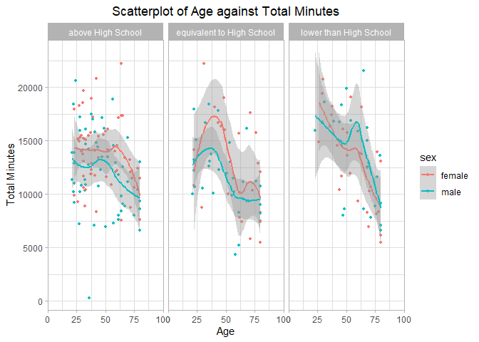

P8105_EZ2384_HW3
================

``` r
# Load the required dataset
  library(p8105.datasets)
      data("ny_noaa")
  library(dplyr)
  library(ggplot2)
  library(tidyverse)
```

### Problem 1

- Dataset `ny_noaa` is of size 2595176 x 7, with variables
  - **id** \[char\]: Weather station ID
  - **date** \[date\]: Date of observation
  - **prcp** \[int\] : Precipitation (tenths of mm)
  - **snow** \[int\] : Snowfall (mm)
  - **snwd** \[int\] : Snow depth (mm)
  - **tmax** \[char\]: Maximum temperature (tenths of degrees C)
  - **tmin** \[char\]: Minimum temperature (tenths of degrees C)
- Missing Data
  - `tmin` and `tmax` contains a great deal of missing values
  - `prcp` and `snow` contains some missing values
  - `id` and `date` are complete
- Data Cleaning Procedures
  - preliminary cleaning (give reasonable column names, rename column
    names to be more straightforward)
  - created new columns year,month,day
  - dropped all NA values
  - changed all column types except for id and date into integer type to
    facilitate future conversions
  - changed column values for temperature, precipitation, snowfall so
    that are given in integer units

<!-- -->

    ## # A tibble: 248 × 2
    ## # Groups:   snowfall(mm) [248]
    ##    `snowfall(mm)`   count
    ##             <int>   <int>
    ##  1              0 1112758
    ##  2             25   15809
    ##  3             13   12460
    ##  4             51    9252
    ##  5              5    5669
    ##  6              8    5380
    ##  7             76    5296
    ##  8              3    5276
    ##  9             38    5050
    ## 10            102    3386
    ## # ℹ 238 more rows

- For snowfall, the most commonly observed values are 0, which has a
  total occurrence of 1112758

### Problem 2

- Load, tidy, merge, and otherwise organize the data sets. Exclusion of
  participants less than 21 yrs and those with missing demographic data.
  Encoded dataset so that all columns in the demographics dataset are
  converted into character type.

``` r
  demographics =  read.csv("../../Datasets/participant_demographics.csv", skip=4) %>% janitor::clean_names() %>% filter(age>=21) %>%
                  mutate(across(seqn:education, as.character)) %>%  
                  mutate(sex=recode(sex, "1"="male", "2"="female"), 
                         education=recode(education, "1"="lower than High School", "2"="equivalent to High School", "3"="above High School")) %>%                   rename(id=seqn) %>% drop_na()

  accelerometers= read.csv("../../Datasets/accelerometers.csv") %>% janitor::clean_names() %>% rename(id=seqn) %>% mutate(id=as.character(id))
  
  merged = left_join(demographics, accelerometers, "id")
```

- Produce a reader-friendly table for the number of men and women in
  each education category create a visualization of the age
  distributions for men and women in each education category Comment on
  these items.

``` r
  # Table
  table_by_education =  demographics %>% group_by(education, sex) %>% count(name="count")
  table_by_education
```

    ## # A tibble: 6 × 3
    ## # Groups:   education, sex [6]
    ##   education                 sex    count
    ##   <chr>                     <chr>  <int>
    ## 1 above High School         female    59
    ## 2 above High School         male      56
    ## 3 equivalent to High School female    23
    ## 4 equivalent to High School male      35
    ## 5 lower than High School    female    28
    ## 6 lower than High School    male      27

``` r
  # Plot
  barplot = ggplot(demographics, aes(x = sex, fill = education)) +
            geom_bar(position = "dodge") +
            labs(title = "Distribution of Sex by Education Level", x = "Sex", y = "Count", fill = "Education Level") +
            theme_light()
  barplot
```

<!-- -->

- From the bar graph we can see that
  - Females have higher counts of education level above high school
  - Males have an education level more evenly distributed
- Using your tidied dataset, aggregate across minutes to create a total
  activity variable for each participant. Plot these total
  activities(y-axis) against age(x-axis). Your plot should compare men
  to women and have separate panels for each education level. Include a
  trend line or a smooth line to illustrate differences. Comment on your
  plot.

``` r
  # Aggregated Plot
  aggregated = merged %>% mutate(total_minutes=rowSums(select(.,starts_with("min")))) %>% 
                          relocate("id", "sex", "age", "bmi", "education", "total_minutes")
  
  # Plot Total_Minutes against Age
  scatterplot = aggregated %>% mutate(age=as.integer(age)) %>%
                ggplot(., mapping=aes(x=age, y=total_minutes, color=sex)) + geom_point(na.rm=TRUE, size=1) + theme_light() +
                ggtitle("Scatterplot of Age against Total Minutes") + xlab("Age") + ylab("Total Minutes")+
                scale_x_continuous(expand=c(0,0), limits=c(0,100)) + theme(plot.title = element_text(hjust=0.5)) + geom_smooth() +
                facet_grid( . ~ education )
  scatterplot
```

    ## `geom_smooth()` using method = 'loess' and formula = 'y ~ x'

<!-- -->

- From the scatterplot we can see that
  - Overall, participants have lower total minutes as age increases,
    regardless of their sex and education levels.
  - Overall, males tend to have higher total minutes compared to
    females, regardless of their age and education levels.
  - For those with education level above high school, the total minutes
    for subjects is relatively smooth and even. For those with education
    level equivalent to high school, the total minutes for subjects has
    a peak around middle ages. For those with education level lower than
    high school, the total minutes for subjects drops for all age
    intervals as age increases.
- Make a three-panel plot that shows the 24-hour activity time courses
  for each education level and use color to indicate sex. Describe in
  words any patterns or conclusions you can make based on this graph;
  including smooth trends may help identify differences.

### Problem 3
