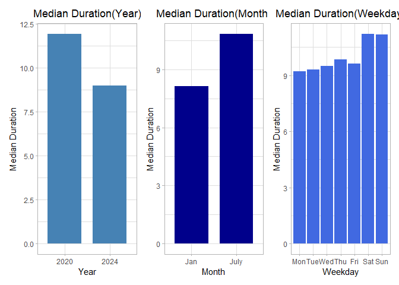

P8105_EZ2384_HW3
================

``` r
# Load the required dataset
  library(p8105.datasets)
      data("ny_noaa")
  library(dplyr)
  library(ggplot2)
  library(tidyverse)
  library(patchwork)
```

### Problem 1

- Dataset `ny_noaa` is of size 2595176 x 7, with variables
  - **id** \[char\]: Weather station ID
  - **date** \[date\]: Date of observation
  - **prcp** \[int\] : Precipitation (tenths of mm)
  - **snow** \[int\] : Snowfall (mm)
  - **snwd** \[int\] : Snow depth (mm)
  - **tmax** \[char\]: Maximum temperature (tenths of degrees C)
  - **tmin** \[char\]: Minimum temperature (tenths of degrees C)
- Missing Data
  - `tmin` and `tmax` contains a great deal of missing values
  - `prcp` and `snow` contains some missing values
  - `id` and `date` are complete
- Data Cleaning Procedures
  - preliminary cleaning (give reasonable column names, rename column
    names to be more straightforward)
  - created new columns year,month,day
  - dropped all NA values
  - changed all column types except for id and date into integer type to
    facilitate future conversions
  - changed column values for temperature, precipitation, snowfall so
    that are given in integer units

<!-- -->

    ## # A tibble: 248 × 2
    ## # Groups:   snowfall(mm) [248]
    ##    `snowfall(mm)`   count
    ##             <int>   <int>
    ##  1              0 1112758
    ##  2             25   15809
    ##  3             13   12460
    ##  4             51    9252
    ##  5              5    5669
    ##  6              8    5380
    ##  7             76    5296
    ##  8              3    5276
    ##  9             38    5050
    ## 10            102    3386
    ## # ℹ 238 more rows

- For snowfall, the most commonly observed values are 0, which has a
  total occurrence of 1112758

### Problem 2

- Load, tidy, merge, and otherwise organize the data sets. Exclusion of
  participants less than 21 yrs and those with missing demographic data.
  Encoded dataset so that all columns in the demographics dataset are
  converted into character type.

``` r
  demographics =  read.csv("../../Datasets/participant_demographics.csv", skip=4) %>% janitor::clean_names() %>% filter(age>=21) %>%
                  mutate(across(seqn:education, as.character)) %>%  
                  mutate(sex=recode(sex, "1"="male", "2"="female"), 
                         education=recode(education, "1"="lower than High School", "2"="equivalent to High School", "3"="above High School")) %>%                   rename(id=seqn) %>% drop_na()

  accelerometers= read.csv("../../Datasets/accelerometers.csv") %>% janitor::clean_names() %>% rename(id=seqn) %>% mutate(id=as.character(id))
  
  merged = left_join(demographics, accelerometers, "id")
```

- Produce a reader-friendly table for the number of men and women in
  each education category create a visualization of the age
  distributions for men and women in each education category Comment on
  these items.

``` r
  # Table
  table_by_education =  demographics %>% group_by(education, sex) %>% count(name="count")
  table_by_education
```

    ## # A tibble: 6 × 3
    ## # Groups:   education, sex [6]
    ##   education                 sex    count
    ##   <chr>                     <chr>  <int>
    ## 1 above High School         female    59
    ## 2 above High School         male      56
    ## 3 equivalent to High School female    23
    ## 4 equivalent to High School male      35
    ## 5 lower than High School    female    28
    ## 6 lower than High School    male      27

``` r
  # Plot
  barplot = ggplot(demographics, aes(x = sex, fill = education)) +
            geom_bar(position = "dodge") +
            labs(title = "Distribution of Sex by Education Level", x = "Sex", y = "Count", fill = "Education Level") +
            theme_light() + theme(plot.title=element_text(hjust=0.5))
  barplot
```

<!-- -->

- From the bar graph we can see that
  - Females have higher counts of education level above high school
  - Males have an education level more evenly distributed
- Using your tidied dataset, aggregate across minutes to create a total
  activity variable for each participant. Plot these total
  activities(y-axis) against age(x-axis). Your plot should compare men
  to women and have separate panels for each education level. Include a
  trend line or a smooth line to illustrate differences. Comment on your
  plot.

``` r
  # Aggregated Plot
  aggregated = merged %>% mutate(total_minutes=rowSums(select(.,starts_with("min")))) %>% 
                          relocate("id", "sex", "age", "bmi", "education", "total_minutes")
  
  # Plot Total_Minutes against Age
  scatterplot_total = aggregated %>% mutate(age=as.integer(age)) %>%
                      ggplot(., mapping=aes(x=age, y=total_minutes, color=sex)) + geom_point(na.rm=TRUE, size=1) + theme_light() +
                      ggtitle("Scatterplot of Age against Total Minutes") + xlab("Age") + ylab("Total Minutes")+
                      scale_x_continuous(expand=c(0,0), limits=c(0,100)) + theme(plot.title = element_text(hjust=0.5)) + geom_smooth() +
                      facet_grid( . ~ education )
  scatterplot_total
```

    ## `geom_smooth()` using method = 'loess' and formula = 'y ~ x'

<!-- -->

``` r
  # Plot 24-H Minutes against Age
  scatterplot_24h = merged %>% mutate(age=as.integer(age)) %>%
                    ggplot(., mapping=aes(x=age, y=))
```

- From the scatterplot we can see that
  - Overall, participants have lower total minutes as age increases,
    regardless of their sex and education levels.
  - Overall, males tend to have higher total minutes compared to
    females, regardless of their age and education levels.
  - For those with education level above high school, the total minutes
    for subjects is relatively smooth and even. For those with education
    level equivalent to high school, the total minutes for subjects has
    a peak around middle ages. For those with education level lower than
    high school, the total minutes for subjects drops for all age
    intervals as age increases.
- Make a three-panel plot that shows the 24-hour activity time courses
  for each education level and use color to indicate sex. Describe in
  words any patterns or conclusions you can make based on this graph;
  including smooth trends may help identify differences.

### Problem 3

- Import, clean, and tidy these data, and describe the resulting
  dataset.

``` r
# CityBike Datasets
  city_bike1 = read.csv("../../Datasets/CityBike/CityBike_Jan2020.csv")   %>% janitor::clean_names() %>% mutate("year"="2020", "month"="Jan")
  city_bike2 = read.csv("../../Datasets/CityBike/CityBike_July2020.csv")  %>% janitor::clean_names() %>% mutate("year"="2020", "month"="July")
  city_bike3 = read.csv("../../Datasets/CityBike/CityBike_Jan2024.csv")   %>% janitor::clean_names() %>% mutate("year"="2024", "month"="Jan")
  city_bike4 = read.csv("../../Datasets/CityBike/CityBike_July2024.csv")  %>% janitor::clean_names() %>% mutate("year"="2024", "month"="July")
  
  head(city_bike1)
```

    ##            ride_id rideable_type  weekdays  duration         start_station_name
    ## 1 4BE06CB33B037044  classic_bike   Tuesday 15.333267     Columbus Ave & W 95 St
    ## 2 26886E034974493B  classic_bike Wednesday  5.309467            2 Ave & E 96 St
    ## 3 24DC56060EBE6260  classic_bike    Friday  9.691800 Columbia St & Rivington St
    ## 4 EEDC1053582D02E5  classic_bike    Sunday  6.996183     W 84 St & Columbus Ave
    ## 5 2CD4BD4CEE2E50A9  classic_bike    Friday  2.849500     Forsyth St & Broome St
    ## 6 E18682F9A4E501BB  classic_bike    Sunday 25.523467       Allen St & Hester St
    ##           end_station_name member_casual year month
    ## 1    E 53 St & Madison Ave        member 2020   Jan
    ## 2         1 Ave & E 110 St        member 2020   Jan
    ## 3  Grand St & Elizabeth St        member 2020   Jan
    ## 4   Columbus Ave & W 72 St        member 2020   Jan
    ## 5  Suffolk St & Stanton St        member 2020   Jan
    ## 6 Atlantic Ave & Furman St        member 2020   Jan

``` r
  head(city_bike2)
```

    ##            ride_id rideable_type  weekdays  duration
    ## 1 A7503F194A7CB244  classic_bike    Sunday  9.862550
    ## 2 B47EBE0EA71E3275  classic_bike    Monday  8.289867
    ## 3 8146F6C6855338C8  classic_bike Wednesday  5.390200
    ## 4 D49560E3308D2128  classic_bike  Saturday 19.203617
    ## 5 87687AAE400824DE  classic_bike   Tuesday 26.420533
    ## 6 E30DFCD98462C9F9  classic_bike    Sunday 51.902067
    ##            start_station_name                 end_station_name member_casual
    ## 1  Franklin Ave & Empire Blvd Grand Army Plaza & Plaza St West        member
    ## 2             E 33 St & 1 Ave                  E 33 St & 5 Ave        member
    ## 3      George St & Wilson Ave     Willoughby Ave & Wyckoff Ave        member
    ## 4 St. Nicholas Ave & W 126 St            Willis Ave & E 143 St        member
    ## 5           Front St & Jay St          Grand St & Elizabeth St        member
    ## 6   Clinton St & Joralemon St           Myrtle Ave & Linden St        casual
    ##   year month
    ## 1 2020  July
    ## 2 2020  July
    ## 3 2020  July
    ## 4 2020  July
    ## 5 2020  July
    ## 6 2020  July

``` r
  head(city_bike3)
```

    ##            ride_id rideable_type  weekdays  duration         start_station_name
    ## 1 644A0105ACA27B15 electric_bike Wednesday 16.472933   Lafayette St & Jersey St
    ## 2 A5A8C0AD18EDA2C0 electric_bike Wednesday  6.294983    Clinton St & Tillary St
    ## 3 B392CE3496831A89 electric_bike   Tuesday  6.119750     West End Ave & W 94 St
    ## 4 33756EDC77800B6A electric_bike Wednesday 10.875667    Grand St & Elizabeth St
    ## 5 29D9AF64D6593D9B electric_bike  Thursday  8.416267           12 Ave & W 40 St
    ## 6 C7E61191A30649D5 electric_bike    Sunday 18.540983 7 Ave & Central Park South
    ##                end_station_name member_casual year month
    ## 1               W 50 St & 9 Ave        member 2024   Jan
    ## 2   Duffield St & Willoughby St        member 2024   Jan
    ## 3           W 116 St & Broadway        member 2024   Jan
    ## 4             Front St & Jay St        member 2024   Jan
    ## 5 Washington St & Gansevoort St        member 2024   Jan
    ## 6           44 Dr & Jackson Ave        member 2024   Jan

``` r
  head(city_bike4)
```

    ##            ride_id rideable_type  weekdays  duration      start_station_name
    ## 1 86AE148E36FBF035  classic_bike    Sunday 19.661183            Picnic Point
    ## 2 FCF07A30F66B9B07 electric_bike  Thursday  7.676433         W 54 St & 9 Ave
    ## 3 D8397E843C06644D  classic_bike  Thursday 24.465950        12 Ave & W 40 St
    ## 4 E575690C13424E8C electric_bike   Tuesday  3.528600 Grand St & Havemeyer St
    ## 5 184AABED46DCE11A electric_bike Wednesday 24.126050     Broadway & Kent Ave
    ## 6 ACA61A92B5EA0D11  classic_bike  Saturday  7.825750          E 1 St & 1 Ave
    ##          end_station_name member_casual year month
    ## 1   Yankee Ferry Terminal        casual 2024  July
    ## 2         W 42 St & 8 Ave        casual 2024  July
    ## 3 W 84 St & Amsterdam Ave        member 2024  July
    ## 4      S 4 St & Rodney St        member 2024  July
    ## 5    Henry St & Degraw St        casual 2024  July
    ## 6   Mercer St & Spring St        member 2024  July

``` r
# Combined CityBike Dataframe
  city_bike_binded = bind_rows(city_bike1,city_bike2,city_bike3,city_bike4) %>%
                     relocate("ride_id", "member_casual", "year", "month", "weekdays", "rideable_type", "start_station_name", "end_station_name") %>%
                     rename("id"="ride_id", "type"="member_casual", "bike"="rideable_type", "start_station"="start_station_name", "end_station"="end_station_name") %>%
                     mutate(weekdays=recode(weekdays, "Monday"="Mon","Tuesday"="Tue", "Wednesday"="Wed", "Thursday"="Thu", "Friday"="Fri", "Saturday"="Sat", "Sunday"="Sun")) %>%
                     mutate(weekdays=factor(weekdays, levels = c("Mon", "Tue", "Wed", "Thu", "Fri", "Sat", "Sun")))
  head(city_bike_binded)
```

    ##                 id   type year month weekdays         bike
    ## 1 4BE06CB33B037044 member 2020   Jan      Tue classic_bike
    ## 2 26886E034974493B member 2020   Jan      Wed classic_bike
    ## 3 24DC56060EBE6260 member 2020   Jan      Fri classic_bike
    ## 4 EEDC1053582D02E5 member 2020   Jan      Sun classic_bike
    ## 5 2CD4BD4CEE2E50A9 member 2020   Jan      Fri classic_bike
    ## 6 E18682F9A4E501BB member 2020   Jan      Sun classic_bike
    ##                start_station              end_station  duration
    ## 1     Columbus Ave & W 95 St    E 53 St & Madison Ave 15.333267
    ## 2            2 Ave & E 96 St         1 Ave & E 110 St  5.309467
    ## 3 Columbia St & Rivington St  Grand St & Elizabeth St  9.691800
    ## 4     W 84 St & Columbus Ave   Columbus Ave & W 72 St  6.996183
    ## 5     Forsyth St & Broome St  Suffolk St & Stanton St  2.849500
    ## 6       Allen St & Hester St Atlantic Ave & Furman St 25.523467

``` r
# Table showing total number of rides in each combination of year and month
  table_by_YearMonthType =  city_bike_binded %>% group_by(year, month, type) %>% count(name="count")
  table_by_YearMonthType
```

    ## # A tibble: 8 × 4
    ## # Groups:   year, month, type [8]
    ##   year  month type   count
    ##   <chr> <chr> <chr>  <int>
    ## 1 2020  Jan   casual   984
    ## 2 2020  Jan   member 11436
    ## 3 2020  July  casual  5637
    ## 4 2020  July  member 15411
    ## 5 2024  Jan   casual  2108
    ## 6 2024  Jan   member 16753
    ## 7 2024  July  casual 10894
    ## 8 2024  July  member 36262

``` r
# Top 5 originating stations and the corresponding number of rides in July.2024
  top5_starting_positions = city_bike4 %>% group_by(start_station_name) %>% count(name="count")
  head(top5_starting_positions, n=5)
```

    ## # A tibble: 5 × 2
    ## # Groups:   start_station_name [5]
    ##   start_station_name count
    ##   <chr>              <int>
    ## 1 1 Ave & E 110 St      33
    ## 2 1 Ave & E 118 St      21
    ## 3 1 Ave & E 16 St       73
    ## 4 1 Ave & E 18 St       75
    ## 5 1 Ave & E 30 St       57

``` r
# Median Riding Duration depending on Covariates
  median_duration_year     =  city_bike_binded %>% group_by(year) %>% summarise(median_duration = median(duration, na.rm = TRUE))
  median_duration_month    =  city_bike_binded %>% group_by(month) %>% summarise(median_duration = median(duration, na.rm = TRUE))
  median_duration_weekdays =  city_bike_binded %>% group_by(weekdays) %>% summarise(median_duration = median(duration, na.rm = TRUE))
  median_duration_membership  =  city_bike_binded %>% group_by(type) %>% summarise(median_duration = median(duration, na.rm = TRUE))
  median_duration_bike        =  city_bike_binded %>% group_by(bike) %>% summarise(median_duration = median(duration, na.rm = TRUE))

  median_duration_year
```

    ## # A tibble: 2 × 2
    ##   year  median_duration
    ##   <chr>           <dbl>
    ## 1 2020            11.9 
    ## 2 2024             8.98

``` r
  median_duration_month
```

    ## # A tibble: 2 × 2
    ##   month median_duration
    ##   <chr>           <dbl>
    ## 1 Jan              8.14
    ## 2 July            10.8

``` r
  median_duration_weekdays
```

    ## # A tibble: 7 × 2
    ##   weekdays median_duration
    ##   <fct>              <dbl>
    ## 1 Mon                 9.21
    ## 2 Tue                 9.29
    ## 3 Wed                 9.50
    ## 4 Thu                 9.86
    ## 5 Fri                 9.63
    ## 6 Sat                11.2 
    ## 7 Sun                11.2

``` r
  median_duration_membership
```

    ## # A tibble: 2 × 2
    ##   type   median_duration
    ##   <chr>            <dbl>
    ## 1 casual           15.2 
    ## 2 member            8.92

``` r
  median_duration_bike  
```

    ## # A tibble: 2 × 2
    ##   bike          median_duration
    ##   <chr>                   <dbl>
    ## 1 classic_bike            10.2 
    ## 2 electric_bike            9.46

``` r
# Subplots of Median Riding Duration depending on year/month/weekday
  subplot1 = ggplot(median_duration_year, aes(x = year, y = median_duration)) +
             geom_bar(stat="identity", fill="steelblue", width=0.75) +
             xlab("Year") + ylab("Median Duration") + ggtitle("Median Duration(Year)") +
             theme_light() + theme(plot.title = element_text(hjust=0.5))
  
  subplot2 = ggplot(median_duration_month, aes(x=month, y=median_duration)) +
             geom_bar(stat="identity", fill="darkblue", width=0.75) +
             xlab("Month") + ylab("Median Duration") + ggtitle("Median Duration(Month)") +
             theme_light() + theme(plot.title = element_text(hjust=0.5))
  
  subplot3 = ggplot(median_duration_weekdays, aes(x=weekdays, y=median_duration)) +
             geom_bar(stat="identity", fill="royalblue") +
             xlab("Weekday") + ylab("Median Duration") + ggtitle("Median Duration(Weekday)") +
             theme_light() + theme(plot.title = element_text(hjust=0.5))

# Final plot of Median Riding Duration depending on Year/Month/Weekday
  subplot1 + subplot2 + subplot3
```

<!-- -->

``` r
# Figure showing impact of month, membership status, and bike type on the distribution of ride duration

  subplot4 = ggplot(median_duration_membership, aes(x = type, y = median_duration)) +
             geom_bar(stat="identity", fill="darkgreen", width=0.75) +
             xlab("Membership Type") + ylab("Median Duration") + ggtitle("Median Duration(Membership Type)") +
             theme_light() + theme(plot.title = element_text(hjust=0.5))
  
  subplot5 = ggplot(median_duration_bike, aes(x=bike, y=median_duration)) +
             geom_bar(stat="identity", fill="darkred", width=0.75) +
             xlab("Bike Type") + ylab("Median Duration") + ggtitle("Median Duration(Bike Type)") +
             theme_light() + theme(plot.title = element_text(hjust=0.5))

  # Final Plot of Median Riding Duration depending on Membership_Type/Bike_Type
  subplot4 + subplot5
```

<!-- -->

- Description of CityBike Datasets

- Comment on table_by_YearMonthType

  - The total number of riders rise considerably each year from 2020 to
    2024, and has risen from 12480 riders in Jan.2020 to 47156 riders in
    July.2024.
  - The total number of members rise steadily and considerably each time
    interval from Jan.2020 to July.2020 to Jan.2024 to July.2024
  - Overall, for each timeslot, the number of members are considerably
    lower compared to the number of casual riders at that time.

- Remark on plot showing median durations depending on
  year/month/weekday

  - We can see a clear pattern that, citybike users in weekends are
    considerably more active compared to them in weekdays.
  - The median users in 2024 is lower than that in 2020; and the median
    users in July is higher than that in January. However, without more
    year groups and/or more month groups, we cannot conclude for sure
    whether there is a true pattern or the observed difference is due
    merely to chance.

- Remark on plot showing median durations depending on
  membership_type/bike_type

  - Overall, those who are casual riders have a longer biking duration
    compared to members by a great amount.
  - Overall, users spend longer time using classic bikes compared to
    electric bikes, but this difference is not big.
