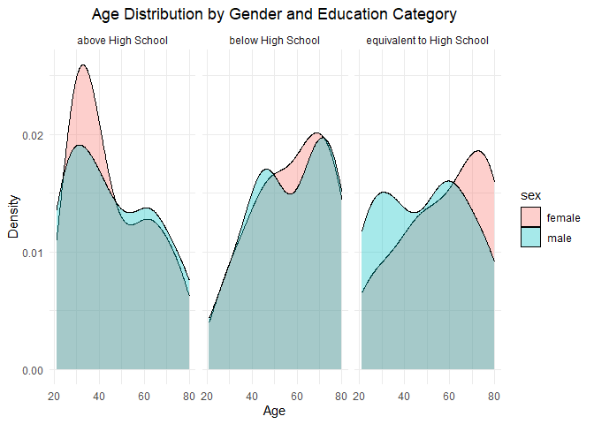
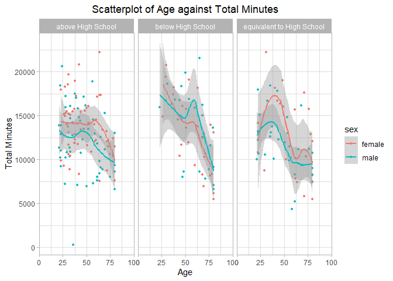

P8105_EZ2384_HW3
================

``` r
# Load relevant packages
  library(p8105.datasets)
  library(dplyr)
  library(ggplot2)
  library(tidyverse)
  library(patchwork)

# Load relevant datasets
  # For Prob.1
    data("ny_noaa")
  # For Prob.2
    demographics   = read.csv("./participant_demographics.csv", skip=4)
    accelerometers = read.csv("./accelerometers.csv")
  # For Prob.3
    city_bike1 = read.csv("./CityBike/CityBike_Jan2020.csv")   %>% janitor::clean_names() %>% mutate("year"="2020", "month"="Jan")
    city_bike2 = read.csv("./CityBike/CityBike_July2020.csv")  %>% janitor::clean_names() %>% mutate("year"="2020", "month"="July")
    city_bike3 = read.csv("./CityBike/CityBike_Jan2024.csv")   %>% janitor::clean_names() %>% mutate("year"="2024", "month"="Jan")
    city_bike4 = read.csv("./CityBike/CityBike_July2024.csv")  %>% janitor::clean_names() %>% mutate("year"="2024", "month"="July")
```

### Problem 1

- Dataset `ny_noaa` is of size 2595176 x 7, with variables
  - **id** \[char\]: Weather station ID
  - **date** \[date\]: Date of observation
  - **prcp** \[int\] : Precipitation (tenths of mm)
  - **snow** \[int\] : Snowfall (mm)
  - **snwd** \[int\] : Snow depth (mm)
  - **tmax** \[char\]: Maximum temperature (tenths of degrees C)
  - **tmin** \[char\]: Minimum temperature (tenths of degrees C)
- Missing Data
  - `tmin` and `tmax` contains a great deal of missing values
  - `prcp` and `snow` contains some missing values
  - `id` and `date` are complete
- Data Cleaning Procedures
  - preliminary cleaning (give reasonable column names, rename column
    names to be more straightforward)
  - created new columns year,month,day
  - dropped all NA values
  - changed all column types except for id and date into integer type to
    facilitate future conversions
  - changed column values for temperature, precipitation, snowfall so
    that are given in integer units

<!-- -->

    ## # A tibble: 248 × 2
    ## # Groups:   snowfall(mm) [248]
    ##    `snowfall(mm)`   count
    ##             <int>   <int>
    ##  1              0 1112758
    ##  2             25   15809
    ##  3             13   12460
    ##  4             51    9252
    ##  5              5    5669
    ##  6              8    5380
    ##  7             76    5296
    ##  8              3    5276
    ##  9             38    5050
    ## 10            102    3386
    ## # ℹ 238 more rows

- For snowfall, the most commonly observed values are 0, which has a
  total occurrence of 1112758

### Problem 2

``` r
# Load, tidy, merge, and organize datasets. Exclusion of participants less than 21 yrs and those with missing demographic data.
  demographics =  demographics %>% janitor::clean_names() %>% filter(age>=21) %>% mutate(across(seqn:education, as.character)) %>%  
                  mutate(sex=recode(sex, "1"="male", "2"="female"), 
                         education=recode(education, "1"="below High School", "2"="equivalent to High School", "3"="above High School")) %>% rename(id=seqn) %>% drop_na()

  accelerometers= accelerometers %>% janitor::clean_names() %>% rename(id=seqn) %>% mutate(id=as.character(id))
  
  merged = left_join(demographics, accelerometers, "id")
  
# Table
  table_by_education =  demographics %>% group_by(education, sex) %>% count(name="count")
  table_by_education
```

    ## # A tibble: 6 × 3
    ## # Groups:   education, sex [6]
    ##   education                 sex    count
    ##   <chr>                     <chr>  <int>
    ## 1 above High School         female    59
    ## 2 above High School         male      56
    ## 3 below High School         female    28
    ## 4 below High School         male      27
    ## 5 equivalent to High School female    23
    ## 6 equivalent to High School male      35

``` r
# Plot
  barplot = ggplot(demographics, aes(x = sex, fill = education)) +
            geom_bar(position = "dodge") +
            labs(title = "Distribution of Sex by Education Level", x = "Sex", y = "Count", fill = "Education Level") +
            theme_light() + theme(plot.title=element_text(hjust=0.5))
  barplot
```

<!-- -->

``` r
# Aggregated Plot
  aggregated = merged %>% mutate(total_minutes=rowSums(select(.,starts_with("min")))) %>%  relocate("id", "sex", "age", "bmi", "education", "total_minutes")
  
# Plot Total_Minutes against Age
  scatterplot_total = aggregated %>% mutate(age=as.integer(age)) %>%
                      ggplot(., mapping=aes(x=age, y=total_minutes, color=sex)) + geom_point(na.rm=TRUE, size=1) + theme_light() +
                      ggtitle("Scatterplot of Age against Total Minutes") + xlab("Age") + ylab("Total Minutes")+
                      scale_x_continuous(expand=c(0,0), limits=c(0,100)) + theme(plot.title = element_text(hjust=0.5)) + geom_smooth() +
                      facet_grid( . ~ education )
  scatterplot_total
```

    ## `geom_smooth()` using method = 'loess' and formula = 'y ~ x'

<!-- -->

``` r
# Scatterplot of 24H-Minutes against Mean Acceleratorometers Readings
  temp_longer = merged %>% pivot_longer(., cols = starts_with("min"), names_to = "minutes", values_to = "readings") %>%
                mutate(minutes = as.numeric(gsub("min","",minutes)))
  readings_longer = merged %>% pivot_longer(., cols = starts_with("min"), names_to = "minutes", values_to = "readings") %>%
                    mutate(minutes = as.numeric(gsub("min","",minutes))) %>% group_by(minutes, sex, education) %>% summarise(mean=mean(readings, na.rm=TRUE))
```

    ## `summarise()` has grouped output by 'minutes', 'sex'. You can override using
    ## the `.groups` argument.

``` r
  scatterplot_24H = ggplot(readings_longer, mapping=aes(x=minutes, y=mean, color=sex)) + geom_point(size=0.25, rm.NA=TRUE) + theme_light() + facet_grid(.~education) + 
                    geom_smooth(size=0.7) + scale_x_continuous(limits=c(0,1400), breaks=seq(0,1400, by=200)) + 
                    scale_y_continuous(limits=c(0,18), breaks=seq(0,18,by=3)) + xlab("24H Scale in Minutes") + ylab("Mean Acceleratorometers Readings per Minute") +
                    ggtitle("Scatterplot of 24H-Minutes against Mean Acceleratorometers Readings") + theme(legend.position = "bottom", plot.title=element_text(hjust=.5))
```

    ## Warning in geom_point(size = 0.25, rm.NA = TRUE): Ignoring unknown parameters:
    ## `rm.NA`

    ## Warning: Using `size` aesthetic for lines was deprecated in ggplot2 3.4.0.
    ## ℹ Please use `linewidth` instead.
    ## This warning is displayed once every 8 hours.
    ## Call `lifecycle::last_lifecycle_warnings()` to see where this warning was
    ## generated.

``` r
  scatterplot_24H
```

    ## `geom_smooth()` using method = 'gam' and formula = 'y ~ s(x, bs = "cs")'

    ## Warning: Removed 240 rows containing non-finite outside the scale range
    ## (`stat_smooth()`).

    ## Warning: Removed 240 rows containing missing values or values outside the scale range
    ## (`geom_point()`).

<!-- -->

- Remark on the barplot showing the distribution of sex by education
  level
  - Females have higher counts of education level above high school
  - Males have an education level more evenly distributed
- Remark on the scatterplot of total_activities against age,
  distinguished by sex, paneled by education level
  - Overall, participants have lower total minutes as age increases,
    regardless of their sex and education levels.
  - Overall, males tend to have higher total minutes compared to
    females, regardless of their age and education levels.
  - For those with education level above high school, the total minutes
    for subjects is relatively smooth and even. For those with education
    level equivalent to high school, the total minutes for subjects has
    a peak around middle ages. For those with education level lower than
    high school, the total minutes for subjects drops for all age
    intervals as age increases.
- Remark on the scatterplot of 24H Minutes against Mean Accelerometers
  Readings per minute
  - We can see that the mean Accelerometers Readings per minute across
    the 24H scale exhibit the following general pattern:
    - The mean readings tend to fluctuate greatly during the course of a
      day
    - The mean readings reaches the lowest point at around 200-300
      minutes(about 3am to 5am) and arrived at peak at about 600-850
      minutes(about 10am to 2pm).
    - The curve increases drastically over the course of 5am to 10am;
      and decreases drastically over the course of 2pm and after.
      Moreover, these general patterns stay consistent for all education
      groups and sex groups.
  - Males and Females do not differ greatly on Accelerometers Readings
    over the 24H course.
    - However, overall we can see that the female groups tend to have
      slightly a higher accelerometers readings over the 24H scale.
  - Different education groups do not differ greatly on Accelerometers
    Readings over the 24H course.

### Problem 3

- Import, clean, and tidy these data, and describe the resulting
  dataset.

``` r
# Combined CityBike Dataframe
  city_bike_binded = bind_rows(city_bike1,city_bike2,city_bike3,city_bike4) %>%
                     relocate("ride_id", "member_casual", "year", "month", "weekdays", "rideable_type", "start_station_name", "end_station_name") %>%
                     rename("id"="ride_id", "type"="member_casual", "bike"="rideable_type", "start_station"="start_station_name", "end_station"="end_station_name") %>%
                     mutate(weekdays=recode(weekdays, "Monday"="Mon","Tuesday"="Tue", "Wednesday"="Wed", "Thursday"="Thu", "Friday"="Fri", "Saturday"="Sat", "Sunday"="Sun")) %>%
                     mutate(weekdays=factor(weekdays, levels = c("Mon", "Tue", "Wed", "Thu", "Fri", "Sat", "Sun")))

# Table showing total number of rides in each combination of year and month
  table_by_YearMonthType =  city_bike_binded %>% group_by(year, month, type) %>% count(name="count")
  table_by_YearMonthType
```

    ## # A tibble: 8 × 4
    ## # Groups:   year, month, type [8]
    ##   year  month type   count
    ##   <chr> <chr> <chr>  <int>
    ## 1 2020  Jan   casual   984
    ## 2 2020  Jan   member 11436
    ## 3 2020  July  casual  5637
    ## 4 2020  July  member 15411
    ## 5 2024  Jan   casual  2108
    ## 6 2024  Jan   member 16753
    ## 7 2024  July  casual 10894
    ## 8 2024  July  member 36262

``` r
# Top 5 originating stations and the corresponding number of rides in July.2024
  top5_starting_positions = city_bike4 %>% group_by(start_station_name) %>% count(name="count") %>% arrange(desc(count))
  head(top5_starting_positions, n=5)
```

    ## # A tibble: 5 × 2
    ## # Groups:   start_station_name [5]
    ##   start_station_name       count
    ##   <chr>                    <int>
    ## 1 Pier 61 at Chelsea Piers   163
    ## 2 University Pl & E 14 St    155
    ## 3 W 21 St & 6 Ave            152
    ## 4 West St & Chambers St      150
    ## 5 W 31 St & 7 Ave            146

``` r
# Median Riding Duration depending on Covariates
  median_duration_year        =  city_bike_binded %>% group_by(year) %>% summarise(median_duration = median(duration, na.rm = TRUE))
  median_duration_month       =  city_bike_binded %>% group_by(month) %>% summarise(median_duration = median(duration, na.rm = TRUE))
  median_duration_weekdays    =  city_bike_binded %>% group_by(weekdays) %>% summarise(median_duration = median(duration, na.rm = TRUE))
  median_duration_membership  =  city_bike_binded %>% group_by(type) %>% summarise(median_duration = median(duration, na.rm = TRUE))
  median_duration_bike        =  city_bike_binded %>% group_by(bike) %>% summarise(median_duration = median(duration, na.rm = TRUE))

# Subplots of Median Riding Duration depending on year/month/weekday
  subplot1 = ggplot(median_duration_year, aes(x = year, y = median_duration)) +
             geom_bar(stat="identity", fill="steelblue", width=0.75) +
             xlab("Year") + ylab("Median Duration") + ggtitle("Median Duration(Year)") +
             theme_light() + theme(plot.title = element_text(hjust=0.5))
  
  subplot2 = ggplot(median_duration_month, aes(x=month, y=median_duration)) +
             geom_bar(stat="identity", fill="darkblue", width=0.75) +
             xlab("Month") + ylab("Median Duration") + ggtitle("Median Duration(Month)") +
             theme_light() + theme(plot.title = element_text(hjust=0.5))
  
  subplot3 = ggplot(median_duration_weekdays, aes(x=weekdays, y=median_duration)) +
             geom_bar(stat="identity", fill="royalblue") +
             xlab("Weekday") + ylab("Median Duration") + ggtitle("Median Duration(Weekday)") +
             theme_light() + theme(plot.title = element_text(hjust=0.5))

# Final plot of Median Riding Duration depending on Year/Month/Weekday
  subplot1 + subplot2 + subplot3
```

<!-- -->

``` r
# Figure showing impact of month, membership status, and bike type on the distribution of ride duration

  subplot4 = ggplot(median_duration_membership, aes(x = type, y = median_duration)) +
             geom_bar(stat="identity", fill="darkgreen", width=0.75) +
             xlab("Membership Type") + ylab("Median Duration") + ggtitle("Median Duration(Membership Type)") +
             theme_light() + theme(plot.title = element_text(hjust=0.5))
  
  subplot5 = ggplot(median_duration_bike, aes(x=bike, y=median_duration)) +
             geom_bar(stat="identity", fill="darkred", width=0.75) +
             xlab("Bike Type") + ylab("Median Duration") + ggtitle("Median Duration(Bike Type)") +
             theme_light() + theme(plot.title = element_text(hjust=0.5))

  # Final Plot of Median Riding Duration depending on Membership_Type/Bike_Type
  subplot4 + subplot5
```

<!-- -->

- Description of CityBike Datasets
  - CityBike Datasets consists of 4 component datasets with each
    consisting of 7 variables:
    - ride_id : unique identifier for CityBike user for the particular
      trip
    - rideable_type: type of bike used by user for the particular trip
    - weekdays: weekday info when riding for the particular trip
    - duration: duration or ride for the particular trip
    - start_station_name: set-off station name for the particular trip
    - end_station_name: ending station name for the particular trip
    - member_casual: membership type of the user for the particular trip
  - Each dataset has dimensions as below:
    - Dataset1: info of Jan.2020, dimension=12420 x 7
    - Dataset2: info of July.2020, dimension=21048 x 7
    - Dataset3: info of Jan.2024, dimension=18861 x 7
    - Dataset4: info of July.2024, dimension=47156 x 7
  - Completeness:
    - Each component dataset is complete and without missing values
- Comment on table_by_YearMonthType
  - The total number of riders rise considerably each year from 2020 to
    2024, and has risen from 12480 riders in Jan.2020 to 47156 riders in
    July.2024.
  - The total number of members rise steadily and considerably each time
    interval from Jan.2020 to July.2020 to Jan.2024 to July.2024
  - Overall, for each timeslot, the number of members are considerably
    lower compared to the number of casual riders at that time.
- Remark on plot showing median durations depending on
  year/month/weekday
  - We can see a clear pattern that, citybike users in weekends are
    considerably more active compared to them in weekdays.
  - The median users in 2024 is lower than that in 2020; and the median
    users in July is higher than that in January. However, without more
    year groups and/or more month groups, we cannot conclude for sure
    whether there is a true pattern or the observed difference is due
    merely to chance.
- Remark on plot showing median durations depending on
  membership_type/bike_type
  - Overall, those who are casual riders have a longer biking duration
    compared to members by a great amount.
  - Overall, users spend longer time using classic bikes compared to
    electric bikes, but this difference is not big.
